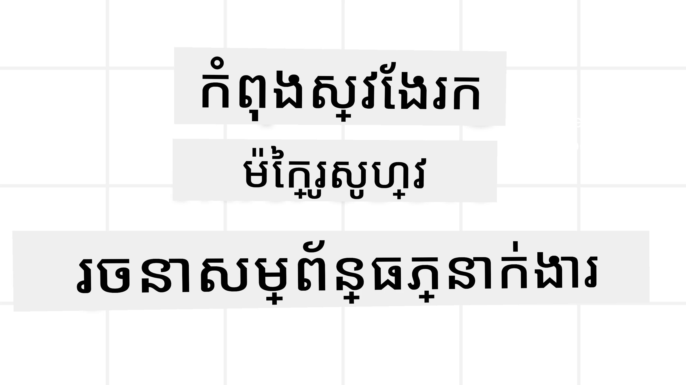
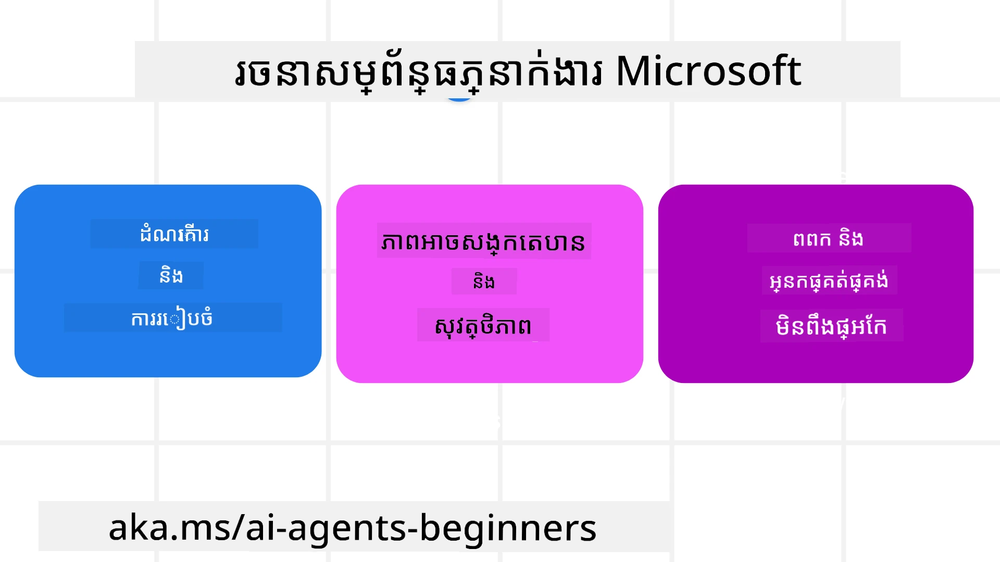
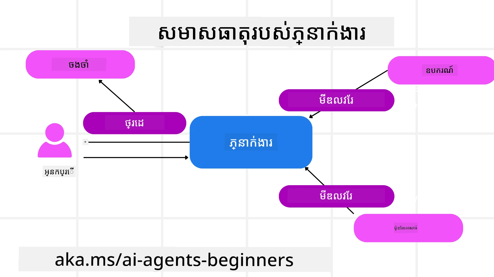

# ការស្រាវជ្រាវអំពី Microsoft Agent Framework



### ការណែនាំ

មេរៀននេះនឹងគិតគូរអំពី៖

- ការយល់ដឹងអំពី Microsoft Agent Framework: លក្ខណៈពិសេសសំខាន់ និងតម្លៃ  
- ស្វែងយល់ពីមូលដ្ឋានគំនិតសំខាន់ៗនៃ Microsoft Agent Framework
- ម៉ូដែល MAF កម្រិតខ្ពស់៖ សញ្ញាសម្ព័ន្ធ ការបណ្តាញចន្លោះ និងការចងចាំ

## គោលបំណង អ្នករៀន

បន្ទាប់ពីបញ្ចប់មេរៀននេះ អ្នកនឹងស្គាល់របៀប៖

- បង្កើត AI Agents ទំនើបប្រើ Microsoft Agent Framework  
- អនុវត្តលក្ខណៈសំខាន់នៃ Microsoft Agent Framework ទៅនឹងករណីប្រើ Agentic របស់អ្នក  
- ប្រើបែបបទកម្រិតខ្ពស់រួមមាន សញ្ញាសម្ព័ន្ធ ការបណ្តាញចន្លោះ និងការពិនិត្យមើល

## ឧទាហរណ៍កូដ 

ឧទាហរណ៍កូដសម្រាប់ [Microsoft Agent Framework (MAF)](https://aka.ms/ai-agents-beginners/agent-framewrok) អាចរកបាននៅក្នុងដាក់ឯកសារនេះនៅក្រោមឯកសារ `xx-python-agent-framework` និង `xx-dotnet-agent-framework`។

## ការយល់ដឹងអំពី Microsoft Agent Framework



[Microsoft Agent Framework (MAF)](https://aka.ms/ai-agents-beginners/agent-framewrok) គឺជាសំណុំឧបករណ៍រួមរបស់ Microsoft សម្រាប់ការបង្កើត AI agents។ វាបង្ហាញនូវភាពបត់បែនដើម្បីដោះស្រាយប្រភេទការប្រើប្រាស់ agentic ផ្សេងៗដែលឃើញក្នុងបរិបទផលិតកម្ម និងស្រាវជ្រាវ រួមមាន៖

- **ការ​គ្រប់គ្រង Agent តាមលំដាប់** នៅក្នុងស្ថានការណ៍ដែលត្រូវការសន្ធិសម្ព័ន្ធជាទីតាំងជំហានៗ។  
- **ការ​គ្រប់គ្រងដោយពួកគេបញ្ចូលដំណើរការ (concurrent)** នៅក្នុងស្ថានការណ៍ដែល agents ត្រូវបញ្ចប់កិច្ចការ​នៅពេលតែមួយ។  
- **ការ​គ្រប់គ្រង វេទិកាសន្ទនា​ក្រុម** នៅក្នុងស្ថានការណ៍ដែល agents អាចសហការជាមួយគ្នាលើកិច្ចការតែមួយ។  
- **ការ​គ្រប់គ្រងដោយដៃប្តូរ (handoff)** នៅក្នុងស្ថានការណ៍ដែលបេក្ខជនប្តូរទំនួលខុសត្រូវកិច្ចការទៅអ្នកដទៃក្នុងពេលអនុវត្តកិច្ចការជាមួយកាដែលបានបញ្ចប់។  
- **ការ​គ្រប់គ្រងរចនាសម្ព័ន្ធ Magnetic** នៅក្នុងស្ថានការណ៍ដែល agent អ្នកគ្រប់គ្រងបង្កើត និងកែប្រែបញ្ជីកិច្ចការនិងអនុវត្តការសម្របសម្រួលរវាង subagents ដើម្បីបញ្ចប់កិច្ចការ។

ដើម្បីសម្របសម្រួល AI Agents នៅក្នុងផលិតកម្ម MAF ក៏បានរួមបញ្ចូលលក្ខណៈសម្បត្តិសម្រាប់៖

- **ការពិនិត្យមើល** តាមរយៈការប្រើប្រាស់ OpenTelemetry ដែលកំណត់សកម្មភាពរាល់ដំណើរការរបស់ AI Agent រួមមាន ការហៅឧបករណ៍ ដំណើរការសន្ធិសម្ព័ន្ធ ទ្រង់ទ្រាយហេតុផល និងតាមដានសមត្ថភាពតាមតារាង Microsoft Foundry។  
- **សុវត្ថិភាព** ដោយផ្ដួលជំរៅ agents នៅ Microsoft Foundry ដែលរួមបញ្ចូលការត្រួតពិនិត្យសុវត្ថិភាពដូចជា ការចូលដំណើរការតាមតួនាទី ការដោះស្រាយទិន្នន័យឯកជន និងសុវត្ថិភាពមាតិកាដែលបានបង្កើត។  
- **ភាពអាចធន់ទ្រាំ** ដោយអាចបញ្ឈប់ បន្ត និងស្ដារឡើងវិញពីកំហុសបានក្នុង threads និង workflows របស់ agent ដែលអាចដំណើរការកម្មវិធីម៉ោងវែងបាន។  
- **ការត្រួតពិនិត្យ** ដូចសំណុំបែបបទ workflow ដែលមានមនុស្សនៅក្នុងសម្រង់ សម្រាប់បញ្ចេញការអនុញ្ញាតមនុស្សលើកិច្ចការ។

Microsoft Agent Framework ក៏ផ្តោតសំខាន់លើភាពអាចបង្រួបបង្រួមបានដោយ៖

- **មិនពឹងផ្អែក Cloud មួយណា** - Agents អាចដំណើរការនៅក្នុង containers ជា on-prem និងលើ cloud ផ្សេងៗជាច្រើន។  
- **មិនពឹងផ្អែកអ្នកផ្គត់ផ្គង់** - Agents អាចបង្កើតបានតាម SDK ដែលអ្នកចូលចិត្ត រួមមាន Azure OpenAI និង OpenAI។  
- **បង្រួមស្តង់ដាផ្ទៃក្នុង** - Agents អាចប្រើប្រាស់សញ្ញាប័ត្រ​​ដូចជា Agent-to-Agent (A2A) និង Model Context Protocol (MCP) ដើម្បីស្វែងរក និងប្រើប្រាស់ agents និងឧបករណ៍ផ្សេងទៀត។  
- **Plugins និង Connectors** - អាចភ្ជាប់ទៅបណ្តាញទិន្នន័យ និងសេវាកម្មចងចាំ ដូចជា Microsoft Fabric, SharePoint, Pinecone និង Qdrant។

យើងសូមមើលពីរបៀបដែលលក្ខណៈពិសេសទាំងនេះបានអនុវត្តទៅលើមូលដ្ឋានគំនិតសំខាន់ៗនៃ Microsoft Agent Framework។

## មូលដ្ឋានគំនិតសំខាន់ៗនៃ Microsoft Agent Framework

### Agents



**ការបង្កើត Agents**

ការបង្កើត Agent ត្រូវបានធ្វើដោយកំណត់សេវាកម្មលទ្ធផល (LLM Provider),  
ជាបន្ទាត់នៃការណែនាំសម្រាប់ AI Agent ធ្វើតាម និងបង្កើត `name` ដែលបានចាត់តាំង៖

```python
agent = AzureOpenAIChatClient(credential=AzureCliCredential()).create_agent( instructions="You are good at recommending trips to customers based on their preferences.", name="TripRecommender" )
```
  
ខាងលើនេះប្រើប្រាស់ `Azure OpenAI` ប៉ុន្តែ agents អាចបង្កើតបានដោយប្រើសេវាកម្មផ្សេងៗ រួមមាន `Microsoft Foundry Agent Service`៖

```python
AzureAIAgentClient(async_credential=credential).create_agent( name="HelperAgent", instructions="You are a helpful assistant." ) as agent
```
  
OpenAI `Responses`, `ChatCompletion` APIs

```python
agent = OpenAIResponsesClient().create_agent( name="WeatherBot", instructions="You are a helpful weather assistant.", )
```
  
```python
agent = OpenAIChatClient().create_agent( name="HelpfulAssistant", instructions="You are a helpful assistant.", )
```
  
ឬ agents ចម្ងាយប្រើប្រាស់សញ្ញាប័ត្រ A2A:

```python
agent = A2AAgent( name=agent_card.name, description=agent_card.description, agent_card=agent_card, url="https://your-a2a-agent-host" )
```
  
**ការប្រតិបត្តិ agents**

Agents ត្រូវបានដំណើរការដោយប្រើវិធី `.run` ឬ `.run_stream` សម្រាប់ការឆ្លើយតបមិនមានប្រព័ន្ធចាក់ចេញទិន្នន័យ ឬ ប្រព័ន្ធចាក់ចេញទិន្នន័យ។

```python
result = await agent.run("What are good places to visit in Amsterdam?")
print(result.text)
```
  
```python
async for update in agent.run_stream("What are the good places to visit in Amsterdam?"):
    if update.text:
        print(update.text, end="", flush=True)

```
  
ការរត់ agent មួយនីមួយៗអាចមានជម្រើសកំណត់លក្ខណៈ ដូចជា `max_tokens` ដែលបានប្រើដោយ agent, `tools` ដែល agent អាចហៅបាន និងថែមទាំង `model` ផ្ទាល់ខ្លួនដែល agent ប្រើ។

នេះមានប្រយោជន៍នៅពេលដែលត្រូវការឧបករណ៍ ឬម៉ូដែលជាក់លាក់សម្រាប់បំពេញកិច្ចការរបស់អ្នកប្រើ។

**ឧបករណ៍**

ឧបករណ៍អាចកំណត់ទាំងពេលកំណត់ agent៖

```python
def get_attractions( location: Annotated[str, Field(description="The location to get the top tourist attractions for")], ) -> str: """Get the top tourist attractions for a given location.""" return f"The top attractions for {location} are." 


# អំពីពេលបង្កើត ChatAgent ផ្ទាល់

agent = ChatAgent( chat_client=OpenAIChatClient(), instructions="You are a helpful assistant", tools=[get_attractions]

```
  
ហើយផងដែរនៅពេលដំណើរការ agent៖

```python

result1 = await agent.run( "What's the best place to visit in Seattle?", tools=[get_attractions] # ឧបករណ៍ផ្តល់ជូនសម្រាប់ការរត់នេះតែម្ដង )
```
  
**Agent Threads**

Agent Threads ប្រើសម្រាប់គ្រប់គ្រងការប្រាស្រ័យទាក់ទងច្រើនជំហាន។ Threads អាចបង្កើតបានតាមរបៀប៖

- ប្រើ `get_new_thread()` ដែលអាចរក្សាទុក thread អាស្រ័យពេលកន្លងទៅ  
- បង្កើត thread ដោយស្វ័យប្រវត្តិ​នៅពេលរត់ agent ហើយ thread នោះកើតមានតែលើរយៈពេលការរត់បច្ចុប្បន្ន។

ដើម្បីបង្កើត thread, កូដមានរូបរាងដូចខាងក្រោម៖

```python
# បង្កើតខ្សែថ្មីមួយ។
thread = agent.get_new_thread() # បើកដំណើរការអ្នកតំណាងជាមួយខ្សែ។
response = await agent.run("Hello, I am here to help you book travel. Where would you like to go?", thread=thread)

```
  
អ្នកហើយអាចបំលែង thread ទៅជាទ្រង់ទ្រាយសំណុំទិន្នន័យសម្រាប់រក្សាទុកប្រើក្រោយ៖

```python
# បង្កើតខ្សែថ្មីមួយ។
thread = agent.get_new_thread() 

# ចាប់ផ្តើមភ្នាក់ងារជាមួយខ្សែ។

response = await agent.run("Hello, how are you?", thread=thread) 

# សម្រួលខ្សែសម្រាប់ការផ្ទុក។

serialized_thread = await thread.serialize() 

# ដកស្រង់ស្ថានភាពខ្សែបន្ទាប់ពីបញ្ចូលពីការផ្ទុក។

resumed_thread = await agent.deserialize_thread(serialized_thread)
```
  
**Agent Middleware**

Agents ធ្វើអន្តរកម្មជាមួយឧបករណ៍ និង LLMs ដើម្បីបំពេញកិច្ចការអ្នកប្រើ។ នៅក្នុងស្ថានការណ៍ខ្លះ យើងចង់អនុវត្ត ឬតាមដានរវាងសកម្មភាពទាំងនេះ។ Agent middleware អនុញ្ញាតឲ្យយើងចងក្រងការនេះតាមរយៈ៖

*Function Middleware*

Middleware នេះអនុញ្ញាតឲ្យយើងអនុវត្តសកម្មភាពរវាង agent និងមុខងារ/ឧបករណ៍ដែល agent នឹងហៅ។ ឧទាហរណ៍មួយដែលអាចប្រើ middleware នេះគឺពេលដែលអ្នកចង់ធ្វើការចុះបញ្ជី log នៅលើការហៅមុខងារ។

នៅក្នុងកូដខាងក្រោម `next` កំណត់ថាតើ middleware បន្ទាប់ ឬមុខងារពិតប្រាកដ គួរត្រូវបានហៅ។

```python
async def logging_function_middleware(
    context: FunctionInvocationContext,
    next: Callable[[FunctionInvocationContext], Awaitable[None]],
) -> None:
    """Function middleware that logs function execution."""
    # ការប្រាស្រ័យទិន្នន័យជាមុន៖ ចុះបញ្ជីមុនការប្រតិបត្តិមុខងារ
    print(f"[Function] Calling {context.function.name}")

    # បន្តទៅមុខងារបន្ទាប់ឬ middleware
    await next(context)

    # ការប្រាស្រ័យទិន្នន័យបន្ទាប់៖ ចុះបញ្ជីបន្ទាប់ការប្រតិបត្តិមុខងារ
    print(f"[Function] {context.function.name} completed")
```
  
*Chat Middleware*

Middleware នេះអនុញ្ញាតឲ្យយើងអនុវត្ត ឬចុះបញ្ជីសកម្មភាពរវាង agent និងសំណើរនៅក្នុងការប្រាស្រ័យទាក់ទងជាមួយ LLM។

វាមានព័ត៌មានសំខាន់ដូចជា `messages` ដែលបានផ្ញើទៅសេវាកម្ម AI។

```python
async def logging_chat_middleware(
    context: ChatContext,
    next: Callable[[ChatContext], Awaitable[None]],
) -> None:
    """Chat middleware that logs AI interactions."""
    # ការប្រព្រឹត្តិមុន៖ កំណត់ហេតុនៅមុនការហៅ AI
    print(f"[Chat] Sending {len(context.messages)} messages to AI")

    # បន្តទៅមួយចំនុចម៉ិឌៀវែរ ឬសេវា AI បន្ទាប់
    await next(context)

    # ការប្រព្រឹត្តិបន្ទាប់៖ កំណត់ហេតុនៅបន្ទាប់ពីការឆ្លើយតប AI
    print("[Chat] AI response received")

```
  
**Agent Memory**

ដូចដែលបានបង្ហាញក្នុងមេរៀន `Agentic Memory` ការចងចាំជាធាតុសំខាន់សម្រាប់អនុញ្ញាតឲ្យ agent ប្រតិបត្ដិលើបរិបទផ្សេងៗគ្នា។ MAF ផ្តល់ជូននូវប្រភេទចងចាំជាច្រើន៖

*In-Memory Storage*

នេះជាការចងចាំដែលរក្សាទុកនៅក្នុង threads ខណៈពេលកម្មវិធីដំណើរការ។

```python
# បង្កើតខ្សែភាពយន្តថ្មី។
thread = agent.get_new_thread() # ធ្វើការប្រតិបត្តិភ្នាក់ងារជាមួយខ្សែភាពយន្ត។
response = await agent.run("Hello, I am here to help you book travel. Where would you like to go?", thread=thread)
```
  
*Persistent Messages*

ចងចាំនេះប្រើសម្រាប់រក្សាទុកប្រវត្តិការសន្ទនា ឆ្លងកាត់មេឡ Sessions ផ្សេងៗ។ វាត្រូវបានកំណត់ដោយប្រើ `chat_message_store_factory`៖

```python
from agent_framework import ChatMessageStore

# បង្កើតឃ្លាំងសារផ្ទាល់ខ្លួន
def create_message_store():
    return ChatMessageStore()

agent = ChatAgent(
    chat_client=OpenAIChatClient(),
    instructions="You are a Travel assistant.",
    chat_message_store_factory=create_message_store
)

```
  
*Dynamic Memory*

ចងចាំនេះត្រូវបានបន្ថែមទៅ context មុនពេល agents ត្រូវបានរត់។ ចងចាំទាំងនេះអាចរក្សាទុក នៅក្នុងសេវាកម្មខាងក្រៅ ដូចជា mem0៖

```python
from agent_framework.mem0 import Mem0Provider

# កំពុងប្រើ Mem0 សម្រាប់សមត្ថភាពម៉េម៉ូរីកម្រិតខ្ពស់
memory_provider = Mem0Provider(
    api_key="your-mem0-api-key",
    user_id="user_123",
    application_id="my_app"
)

agent = ChatAgent(
    chat_client=OpenAIChatClient(),
    instructions="You are a helpful assistant with memory.",
    context_providers=memory_provider
)

```
  
**Agent Observability**

ការពិនិត្យមើលមានសារៈសំខាន់សម្រាប់ការស្ថាបនាប្រព័ន្ធ agentic ដែលអាចទុកចិត្ត និងថែរក្សា។ MAF សម្របខ្លួនជាមួយ OpenTelemetry ដើម្បីផ្ដល់ការតាមដាន និងម៉ែត្រសម្រាប់ការពិនិត្យមើលប្រសើរឡើង។

```python
from agent_framework.observability import get_tracer, get_meter

tracer = get_tracer()
meter = get_meter()
with tracer.start_as_current_span("my_custom_span"):
    # ធ្វើអ្វីមួយ
    pass
counter = meter.create_counter("my_custom_counter")
counter.add(1, {"key": "value"})
```
  
### Workflows

MAF ផ្ដល់នូវ workflows ដែលជាជំហានកំណត់រួចដើម្បីបញ្ចប់កិច្ចការ និងរួមបញ្ចូល AI agents ជាធាតុចូលក្នុងជំហានទាំងនោះ។

Workflows មានធាតុផ្សំនានាដែលអនុញ្ញាតឲ្យមានការគ្រប់គ្រងដំណើរល្អប្រសើរ។ Workflows ក៏អនុញ្ញាតឲ្យមាន **ការគ្រប់គ្រង multi-agent** និង **checkpointing** ដើម្បីរក្សាទុកភាពរៀបចំរបស់ workflow។

ធាតុចម្បងនៃ workflow មាន៖

**Executors**

Executors ទទួលសារចូល ការអនុវត្តកិច្ចការដែលចាត់ទុក ហើយផលិតសារចេញ។ វាដាក់ workflow ទៅមុខក្នុងការបញ្ចប់កិច្ចការធំមួយ។ Executors អាចជាអ្នកជំនាញ AI ឬដំណើរការលោកវ័យបុគ្គល។

**Edges**

Edges ប្រើសម្រាប់កំណត់ចរន្តសារនៅក្នុង workflow។  វាអាចជា៖

*Direct Edges* - តំណភ្ជាប់មួយទៅមួយសាមញ្ញរវាង executors៖

```python
from agent_framework import WorkflowBuilder

builder = WorkflowBuilder()
builder.add_edge(source_executor, target_executor)
builder.set_start_executor(source_executor)
workflow = builder.build()
```
  
*Conditional Edges* - ចាប់ផ្តើមបន្ទាប់ពីបំពេញលក្ខខណ្ឌមួយ។ ឧទាហរណ៍ ពេលបន្ទប់សណ្ឋាគារ គ្មាន សមត្ថភាព, executor អាចផ្តល់ជម្រើសផ្សេងទៀត។

*Switch-case Edges* - ផ្ញើសារទៅ executors ផ្សេងគ្នាតាមលក្ខខណ្ឌបានកំណត់។ ឧ. ប្រសិនបើអតិថិជនដំណើរកម្សាន្តមានការចូលប្រើអាទិភាព កិច្ចការរបស់ពួកគេនឹងត្រូវបានចាត់ចែងតាម workflow ផ្សេង។

*Fan-out Edges* - ផ្ញើសារពីមួយទៅគោលដៅច្រើន។

*Fan-in Edges* - ប្រមូលសារច្រើនពី executors ផ្សេង និងផ្ញើទៅគោលដៅតែមួយ។

**Events**

ដើម្បីផ្ដល់ការពិនិត្យមើលល្អប្រសើរចំពោះ workflows, MAF ផ្ដល់នូវព្រឹត្តិការណ៍ក្នុងការអនុវត្ត រួមមាន៖

- `WorkflowStartedEvent`  - ការដំណើរការ workflow បានចាប់ផ្តើម  
- `WorkflowOutputEvent` - workflow ផលិតលទ្ធផល  
- `WorkflowErrorEvent` - workflow សង្កេតឃើញកំហុស  
- `ExecutorInvokeEvent`  - executor ចាប់ផ្តើមដំណើរការ  
- `ExecutorCompleteEvent`  -  executor បញ្ចប់ដំណើរការ  
- `RequestInfoEvent` - សំណើត្រូវបានបញ្ចេញ

## ម៉ូដែល MAF កម្រិតខ្ពស់

ផ្នែកខាងលើគឺគ្របដណ្តប់មូលដ្ឋានគំនិតសំខាន់ៗនៃ Microsoft Agent Framework។ នៅពេលអ្នកបង្កើត agents សំខាន់ កាន់តែល្អ ប្រើម៉ូដែលកម្រិតខ្ពស់ខាងក្រោម៖

- **Middleware Composition**: តភ្ជាប់អ្នកគ្រប់គ្រង middleware ជាច្រើន (logging, auth, rate-limiting) ដោយប្រើ function និង chat middleware សម្រាប់ការគ្រប់គ្រងលំអិតលើអាកប្បកិរិយា agent។  
- **Workflow Checkpointing**: ប្រើព្រឹត្តិការណ៍ workflow និង serialization ដើម្បីរក្សាទុក និងបន្តដំណើរការរយៈពេលវែងរបស់ agent។  
- **Dynamic Tool Selection**: ផ្សំ RAG លើការពិពណ៌នាឧបករណ៍ជាមួយការចុះបញ្ជីឧបករណ៍របស់ MAF ដើម្បីបង្ហាញឧបករណ៍សមរម្យសម្រាប់ស្នើសុំមួយៗ។  
- **Multi-Agent Handoff**: ប្រើ edges workflow និងថ្នាក់លក្ខខណ្ឌ ដើម្បីគ្រប់គ្រងការផ្ញើរជូនរវាង agents វិសេសីផ្សេងៗគ្នា។

## ឧទាហរណ៍កូដ 

ឧទាហរណ៍កូដសម្រាប់ Microsoft Agent Framework អាចរកបាននៅក្នុងដាក់ឯកសារនេះនៅក្រោមឯកសារ `xx-python-agent-framework` និង `xx-dotnet-agent-framework`។

## មានសំណួរបន្ថែមអំពី Microsoft Agent Framework?

ចូលរួម [Microsoft Foundry Discord](https://aka.ms/ai-agents/discord) ដើម្បីជួបជាមួយអ្នករៀនផ្សេងៗ ចូលរួមម៉ោងការិយាល័យ និងទទួលសំណួរអំពី AI Agents របស់អ្នក។

---

<!-- CO-OP TRANSLATOR DISCLAIMER START -->
**ការបដិសេធ**៖  
ឯកសារនេះត្រូវបានបកប្រែដោយប្រើសេវាកម្មបកប្រែ AI [Co-op Translator](https://github.com/Azure/co-op-translator)។ ខណៈពេលដែលយើងខិតខំដើម្បីភាពត្រឹមត្រូវ សូមយកចិត្តទុកដាក់ថាការបកប្រែដោយស្វ័យប្រវត្តិនឹងអាចមានកំហុស ឬការបញ្ចេញព័ត៌មានមិនត្រឹមត្រូវ។ ឯកសារដើមនៅក្នុងភាសាមាតុភាគគួរត្រូវបានគេយកជាទ្រព្យសម្បត្តិផ្លូវការនៃព័ត៌មាន។ សម្រាប់ព័ត៌មានសំខាន់ៗ អ្នកគួរធ្វើការបកប្រែនៅតាមវិជ្ជាជីវៈដោយមនុស្សជំនាញ។ យើងមិនទទួលខុសត្រូវចំពោះការ​យល់ច្រឡំ ឬការបកប្រែខុសឆ្គងណាមួយដែលកើតឡើងពីការប្រើប្រាស់ការបកប្រែនេះទេ។
<!-- CO-OP TRANSLATOR DISCLAIMER END -->