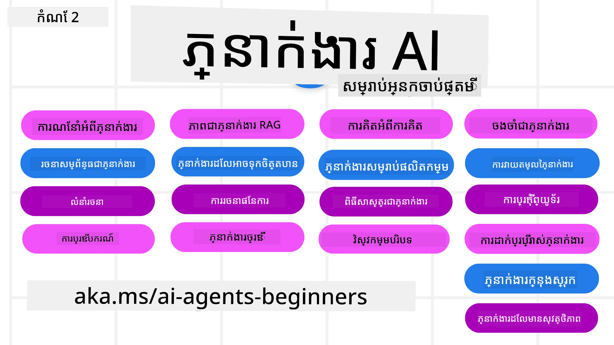

# ប្រភេទ AI សម្រាប់អ្នកចាប់ផ្តើម - មុខវិជ្ជា​មួយ



## មុខវិជ្ជាមួយសម្រង់សិក្សាអំពីរាល់អ្វីដែលអ្នកត្រូវដឹងដើម្បីចាប់ផ្តើមបង្កើតប្រភេទ AI

[](https://github.com/microsoft/ai-agents-for-beginners/blob/master/LICENSE?WT.mc_id=academic-105485-koreyst)
[](https://GitHub.com/microsoft/ai-agents-for-beginners/graphs/contributors/?WT.mc_id=academic-105485-koreyst)
[](https://GitHub.com/microsoft/ai-agents-for-beginners/issues/?WT.mc_id=academic-105485-koreyst)
[](https://GitHub.com/microsoft/ai-agents-for-beginners/pulls/?WT.mc_id=academic-105485-koreyst)
[](http://makeapullrequest.com?WT.mc_id=academic-105485-koreyst)

### 🌐 ការគាំទ្រភាសាច្រើន

#### គាំទ្រតាមរយៈ GitHub Action (ស្វ័យប្រវត្តិ និងអាប់ដេតជានិច្ច)

<!-- CO-OP TRANSLATOR LANGUAGES TABLE START -->
[Arabic](../ar/README.md) | [Bengali](../bn/README.md) | [Bulgarian](../bg/README.md) | [Burmese (Myanmar)](../my/README.md) | [Chinese (Simplified)](../zh-CN/README.md) | [Chinese (Traditional, Hong Kong)](../zh-HK/README.md) | [Chinese (Traditional, Macau)](../zh-MO/README.md) | [Chinese (Traditional, Taiwan)](../zh-TW/README.md) | [Croatian](../hr/README.md) | [Czech](../cs/README.md) | [Danish](../da/README.md) | [Dutch](../nl/README.md) | [Estonian](../et/README.md) | [Finnish](../fi/README.md) | [French](../fr/README.md) | [German](../de/README.md) | [Greek](../el/README.md) | [Hebrew](../he/README.md) | [Hindi](../hi/README.md) | [Hungarian](../hu/README.md) | [Indonesian](../id/README.md) | [Italian](../it/README.md) | [Japanese](../ja/README.md) | [Kannada](../kn/README.md) | [Khmer](./README.md) | [Korean](../ko/README.md) | [Lithuanian](../lt/README.md) | [Malay](../ms/README.md) | [Malayalam](../ml/README.md) | [Marathi](../mr/README.md) | [Nepali](../ne/README.md) | [Nigerian Pidgin](../pcm/README.md) | [Norwegian](../no/README.md) | [Persian (Farsi)](../fa/README.md) | [Polish](../pl/README.md) | [Portuguese (Brazil)](../pt-BR/README.md) | [Portuguese (Portugal)](../pt-PT/README.md) | [Punjabi (Gurmukhi)](../pa/README.md) | [Romanian](../ro/README.md) | [Russian](../ru/README.md) | [Serbian (Cyrillic)](../sr/README.md) | [Slovak](../sk/README.md) | [Slovenian](../sl/README.md) | [Spanish](../es/README.md) | [Swahili](../sw/README.md) | [Swedish](../sv/README.md) | [Tagalog (Filipino)](../tl/README.md) | [Tamil](../ta/README.md) | [Telugu](../te/README.md) | [Thai](../th/README.md) | [Turkish](../tr/README.md) | [Ukrainian](../uk/README.md) | [Urdu](../ur/README.md) | [Vietnamese](../vi/README.md)

> **ចូលចិត្តកក្រើកផ្ទាល់?**
>
> ឃ្លាំងទិន្នន័យនេះមានការប្រែជាភាសាជាង 50 ដែលបង្កើនទំហំទាញយកយ៉ាងខ្លាំង។ ដើម្បីកក្រើកដោយមិនមានការប្រែភាសា ប្រើការជ្រើសយកផ្នែកគ្រឿងទេស:
>
> **Bash / macOS / Linux:**
> ```bash
> git clone --filter=blob:none --sparse https://github.com/microsoft/ai-agents-for-beginners.git
> cd ai-agents-for-beginners
> git sparse-checkout set --no-cone '/*' '!translations' '!translated_images'
> ```
>
> **CMD (Windows):**
> ```cmd
> git clone --filter=blob:none --sparse https://github.com/microsoft/ai-agents-for-beginners.git
> cd ai-agents-for-beginners
> git sparse-checkout set --no-cone "/*" "!translations" "!translated_images"
> ```
>
> នេះនាំឱ្យអ្នកមានគ្រប់អ្វីដែលត្រូវការដើម្បីបញ្ចប់មុខវិជ្ជានេះដោយទាញយកបានលឿនជាង។
<!-- CO-OP TRANSLATOR LANGUAGES TABLE END -->

**បើអ្នកចង់មានភាសាបន្ថែមដែលគាំទ្រ អាចមើលបញ្ជីនៅ [ទីនេះ](https://github.com/Azure/co-op-translator/blob/main/getting_started/supported-languages.md)**

[](https://GitHub.com/microsoft/ai-agents-for-beginners/watchers/?WT.mc_id=academic-105485-koreyst)
[](https://GitHub.com/microsoft/ai-agents-for-beginners/network/?WT.mc_id=academic-105485-koreyst)
[](https://GitHub.com/microsoft/ai-agents-for-beginners/stargazers/?WT.mc_id=academic-105485-koreyst)

[](https://discord.gg/nTYy5BXMWG)


## 🌱 ការចាប់ផ្តើម

មុខវិជ្ជានេះមានមេរៀនដែលគ្របដណ្តប់មូលដ្ឋាននៃការបង្កើតប្រភេទ AI។ មេរៀននីមួយៗគឺមានប្រធានបទផ្ទាល់ខ្លួន ដូច្នេះចាប់ផ្តើមពីកន្លែងណាមួយដែលអ្នកចូលចិត្ត!

មានការគាំទ្រភាសាច្រើនសម្រាប់មុខវិជ្ជានេះ។ ចូលទៅកាន់ [ភាសាដែលអាចប្រើបាននៅទីនេះ](#-multi-language-support)។

បើនេះជាលើកដំបូងអ្នកកំពុងបង្កើតជាមួយម៉ូដែល Generative AI សូមពិនិត្យមើលមុខវិជ្ជា [Generative AI For Beginners](https://aka.ms/genai-beginners) របស់យើង ដែលមានមេរៀន 21 លើការបង្កើតជាមួយ GenAI។

កុំភ្លេច [ផ្កាយ (🌟) រ៉េហ្ស្ពូនេះ](https://docs.github.com/en/get-started/exploring-projects-on-github/saving-repositories-with-stars?WT.mc_id=academic-105485-koreyst) និង [ចម្លែករ៉េហ្ស្ពូនេះ](https://github.com/microsoft/ai-agents-for-beginners/fork) ដើម្បីបើកដំណើរកូដ។

### ស្គាល់អ្នករៀនផ្សេងទៀត ឆ្លើយសំណួររបស់អ្នក

បើអ្នកប្រទះឧបសគ្គ ឬមានសំណួរអំពីការបង្កើតប្រភេទ AI សូមចូលរួមក្នុង Discord Channel ដែលបានបម្រើឯកជនរបស់យើងនៅ [Microsoft Foundry Discord](https://aka.ms/ai-agents/discord)។

### អ្វីដែលអ្នកត្រូវការ

មេរៀននីមួយៗនៅក្នុងមុខវិជ្ជានេះមានឧទាហរណ៍កូដ ដែលអាចរកបាននៅក្នុងថត code_samples។ អ្នកអាច [ចម្លែករ៉េហ្ស្ពូនេះ](https://github.com/microsoft/ai-agents-for-beginners/fork) ដើម្បីបង្កើតច្បាប់ថតផ្ទាល់ខ្លួនរបស់អ្នក។

ឧទាហរណ៍កូដនៅក្នុងលំហាត់ទាំងនេះប្រើ Microsoft Agent Framework ជាមួយ Azure AI Foundry Agent Service V2៖

- [Microsoft Foundry](https://aka.ms/ai-agents-beginners/ai-foundry) - ត្រូវការ​គណនី Azure

មុខវិជ្ជានេះប្រើប្រាស់បណ្ណសារ និងសេវាកម្ម AI Agent តាមម៉ាករ Microsoft:

- [Microsoft Agent Framework (MAF)](https://aka.ms/ai-agents-beginners/agent-framewrok)
- [Azure AI Foundry Agent Service V2](https://aka.ms/ai-agents-beginners/ai-agent-service)


សម្រាប់ព័ត៌មានបន្ថែមអំពីរបៀបរត់កូដសម្រាប់មុខវិជ្ជានេះ សូមចូលទៅកាន់ [ការតំឡើងមុខវិជ្ជា](./00-course-setup/README.md)។

## 🙏 ចង់ជួយទេ?

តើអ្នកមានសំណើណាមួយឬរកឃើញកំហុសការបញ្ចូលអក្សរឬកូដមែនទេ? [ចេញបញ្ហា](https://github.com/microsoft/ai-agents-for-beginners/issues?WT.mc_id=academic-105485-koreyst) ឬ [បង្កើតសំណើបញ្ចូល](https://github.com/microsoft/ai-agents-for-beginners/pulls?WT.mc_id=academic-105485-koreyst)


## 📂 មេរៀននីមួយៗរួមមាន

- មេរៀនជារួមសរសេរក្នុង README និងវីដេអូខ្លីមួយ
- ឧទាហរណ៍កូដ Python ប្រើ Microsoft Agent Framework ជាមួយ Azure AI Foundry
- តំណភ្ជាប់ទៅធនធានបន្ថែមដើម្បីបន្តការរៀនរបស់អ្នក


## 🗃️ មេរៀន

| **មេរៀន**                                   | **អត្ថបទ និងកូដ**                                  | **វីដេអូ**                                                | **ការរៀនបន្ថែម**                                                                      |
|----------------------------------------------|------------------------------------------------------|------------------------------------------------------------|----------------------------------------------------------------------------------------|
| បូកសរុបអំពីប្រភេទ AI និងករណីប្រើប្រាស់      | [តំណភ្ជាប់](./01-intro-to-ai-agents/README.md)       | [វីដេអូ](https://youtu.be/3zgm60bXmQk?si=z8QygFvYQv-9WtO1) | [តំណភ្ជាប់](https://aka.ms/ai-agents-beginners/collection?WT.mc_id=academic-105485-koreyst) |
| ស្វែងយល់ពីបណ្ណសារជាប់ប្រភេទ AI             | [តំណភ្ជាប់](./02-explore-agentic-frameworks/README.md) | [វីដេអូ](https://youtu.be/ODwF-EZo_O8?si=Vawth4hzVaHv-u0H) | [តំណភ្ជាប់](https://aka.ms/ai-agents-beginners/collection?WT.mc_id=academic-105485-koreyst) |
| បកស្រាយលំនាំការរចនាប្រភេទ AI               | [តំណភ្ជាប់](./03-agentic-design-patterns/README.md)  | [វីដេអូ](https://youtu.be/m9lM8qqoOEA?si=BIzHwzstTPL8o9GF) | [តំណភ្ជាប់](https://aka.ms/ai-agents-beginners/collection?WT.mc_id=academic-105485-koreyst) |
| លំនាំការរចនាការប្រើឧបករណ៍                    | [តំណភ្ជាប់](./04-tool-use/README.md)                  | [វីដេអូ](https://youtu.be/vieRiPRx-gI?si=2z6O2Xu2cu_Jz46N) | [តំណភ្ជាប់](https://aka.ms/ai-agents-beginners/collection?WT.mc_id=academic-105485-koreyst) |
| ប្រភេទ AI Agentic RAG                         | [តំណភ្ជាប់](./05-agentic-rag/README.md)               | [វីដេអូ](https://youtu.be/WcjAARvdL7I?si=gKPWsQpKiIlDH9A3) | [តំណភ្ជាប់](https://aka.ms/ai-agents-beginners/collection?WT.mc_id=academic-105485-koreyst) |
| ការបង្កើតប្រភេទ AI ដែលគួរឱ្យទុកចិត្ត          | [តំណភ្ជាប់](./06-building-trustworthy-agents/README.md) | [វីដេអូ](https://youtu.be/iZKkMEGBCUQ?si=jZjpiMnGFOE9L8OK ) | [តំណភ្ជាប់](https://aka.ms/ai-agents-beginners/collection?WT.mc_id=academic-105485-koreyst) |
| លំនាំការរចនាការត្រួតគ្រោង                      | [តំណភ្ជាប់](./07-planning-design/README.md)           | [វីដេអូ](https://youtu.be/kPfJ2BrBCMY?si=6SC_iv_E5-mzucnC) | [តំណភ្ជាប់](https://aka.ms/ai-agents-beginners/collection?WT.mc_id=academic-105485-koreyst) |
| លំនាំការរចនាប្រភេទ Multi-Agent             | [តំណភ្ជាប់](./08-multi-agent/README.md)               | [វីដេអូ](https://youtu.be/V6HpE9hZEx0?si=rMgDhEu7wXo2uo6g) | [តំណភ្ជាប់](https://aka.ms/ai-agents-beginners/collection?WT.mc_id=academic-105485-koreyst) |
| រចនាប័ទ្មការគិតថ្លៃខ្លួនឯង                 | [Link](./09-metacognition/README.md)               | [Video](https://youtu.be/His9R6gw6Ec?si=8gck6vvdSNCt6OcF)  | [Link](https://aka.ms/ai-agents-beginners/collection?WT.mc_id=academic-105485-koreyst) |
| អេជង់ AI ក្នុងផលិតកម្ម                     | [Link](./10-ai-agents-production/README.md)        | [Video](https://youtu.be/l4TP6IyJxmQ?si=31dnhexRo6yLRJDl)  | [Link](https://aka.ms/ai-agents-beginners/collection?WT.mc_id=academic-105485-koreyst) |
| ការប្រើប្រាស់ពិធីការអេជង់ (MCP, A2A និង NLWeb) | [Link](./11-agentic-protocols/README.md)           | [Video](https://youtu.be/X-Dh9R3Opn8)                                 | [Link](https://aka.ms/ai-agents-beginners/collection?WT.mc_id=academic-105485-koreyst) |
| វិស្វកម្មបរិបទសម្រាប់អេជង់ AI            | [Link](./12-context-engineering/README.md)         | [Video](https://youtu.be/F5zqRV7gEag)                                 | [Link](https://aka.ms/ai-agents-beginners/collection?WT.mc_id=academic-105485-koreyst) |
| ការគ្រប់គ្រងអនុស្សាវរីយ៍អេជង់              | [Link](./13-agent-memory/README.md)     |      [Video](https://youtu.be/QrYbHesIxpw?si=vZkVwKrQ4ieCcIPx)                                                      |                                                                                        |
| ការស្វែងយល់អំពីស៊ុមអេជង់ Microsoft                | [Link](./14-microsoft-agent-framework/README.md)                            |                                                            |                                                                                        |
| កសាងអេជង់ប្រើប្រាស់កុំព្យូទ័រ (CUA)           | ​មកដល់ឆាប់ៗនេះ                            |                                                            |                                                                                        |
| ដាក់បង្ហោះអេជង់ដែលអាចពង្រីកបាន                    | ​មកដល់ឆាប់ៗនេះ                            |                                                            |                                                                                        |
| បង្កើតអេជង់ AI មូលដ្ឋាន                     | ​មកដល់ឆាប់ៗនេះ                               |                                                            |                                                                                        |
| ការប្រសើរឡើងនៃសុវត្ថិភាពអេជង់ AI                           | ​មកដល់ឆាប់ៗនេះ                               |                                                            |                                                                                        |

## 🎒 វគ្គសិក្សាផ្សេងៗ

ក្រុមរបស់យើងបង្កើតវគ្គសិក្សាផ្សេងទៀត! សូមពិនិត្យមើល៖

<!-- CO-OP TRANSLATOR OTHER COURSES START -->
### LangChain
[](https://aka.ms/langchain4j-for-beginners)
[](https://aka.ms/langchainjs-for-beginners?WT.mc_id=m365-94501-dwahlin)
[](https://github.com/microsoft/langchain-for-beginners?WT.mc_id=m365-94501-dwahlin)
---

### Azure / Edge / MCP / អេជង់
[](https://github.com/microsoft/AZD-for-beginners?WT.mc_id=academic-105485-koreyst)
[](https://github.com/microsoft/edgeai-for-beginners?WT.mc_id=academic-105485-koreyst)
[](https://github.com/microsoft/mcp-for-beginners?WT.mc_id=academic-105485-koreyst)
[](https://github.com/microsoft/ai-agents-for-beginners?WT.mc_id=academic-105485-koreyst)

---
 
### ស៊េរី AI បង្កើត
[](https://github.com/microsoft/generative-ai-for-beginners?WT.mc_id=academic-105485-koreyst)
[-9333EA?style=for-the-badge&labelColor=E5E7EB&color=9333EA)](https://github.com/microsoft/Generative-AI-for-beginners-dotnet?WT.mc_id=academic-105485-koreyst)
[-C084FC?style=for-the-badge&labelColor=E5E7EB&color=C084FC)](https://github.com/microsoft/generative-ai-for-beginners-java?WT.mc_id=academic-105485-koreyst)
[-E879F9?style=for-the-badge&labelColor=E5E7EB&color=E879F9)](https://github.com/microsoft/generative-ai-with-javascript?WT.mc_id=academic-105485-koreyst)

---
 
### ហ្វឹកហាត់មូលដ្ឋាន
[](https://aka.ms/ml-beginners?WT.mc_id=academic-105485-koreyst)
[](https://aka.ms/datascience-beginners?WT.mc_id=academic-105485-koreyst)
[](https://aka.ms/ai-beginners?WT.mc_id=academic-105485-koreyst)
[](https://github.com/microsoft/Security-101?WT.mc_id=academic-96948-sayoung)
[](https://aka.ms/webdev-beginners?WT.mc_id=academic-105485-koreyst)
[](https://aka.ms/iot-beginners?WT.mc_id=academic-105485-koreyst)
[](https://github.com/microsoft/xr-development-for-beginners?WT.mc_id=academic-105485-koreyst)

---
 
### ស៊េរី Copilot
[](https://aka.ms/GitHubCopilotAI?WT.mc_id=academic-105485-koreyst)
[](https://github.com/microsoft/mastering-github-copilot-for-dotnet-csharp-developers?WT.mc_id=academic-105485-koreyst)
[](https://github.com/microsoft/CopilotAdventures?WT.mc_id=academic-105485-koreyst)
<!-- CO-OP TRANSLATOR OTHER COURSES END -->

## 🌟 អរគុណសហគមន៍

អរគុណ [Shivam Goyal](https://www.linkedin.com/in/shivam2003/) សម្រាប់ការចូលរួមបង្ហាញកូដសំខាន់ៗដែលបង្ហាញពី Agentic RAG។ 

## ការចូលរួម

គម្រោងនេះស្វាគមន៍ការចូលរួមនិងការផ្តល់យោបល់។ ការចូលរួមភាគច្រើនដាក់សូមស្របតាម
សន្ធិសញ្ញាសិទ្ធិរបស់អ្នកចូលរួម (CLA) បញ្ជាក់ថាអ្នកមានសិទ្ធិ និងពិតប្រាកដផ្តល់សិទ្ធិ
ដល់យើងក្នុងការប្រើប្រាស់ការចូលរួមរបស់អ្នក។ សម្រាប់ព័ត៌មានលម្អិត សូមទៅកាន់ <https://cla.opensource.microsoft.com>។

ពេលអ្នកដាក់សំណើ pull request មួយ បុត CLA នឹងកំណត់ដោយស្វ័យប្រវត្តិថាតើអ្នកត្រូវ
ផ្តល់ CLA ឬអត់ ហើយតាមដានសំណើ PR បែបសមរម្យ (ឧ. ត្រួតពិនិត្យស្ថានភាព, កំណត់ចំណាំ) ។ សូមអនុវត្តតាមការណែនាំ
ដែលបុតផ្តល់។ អ្នកត្រូវធ្វើតែម្តងតែមួយសម្រាប់រេហ្វបាទទាំងអស់ប្រើ CLA របស់យើង។

គម្រោងនេះទទួលយកច្បាប់អនុវត្តកូដប្រព័ន្ធបើកចំហ Microsoft ប្រភេទ [Microsoft Open Source Code of Conduct](https://opensource.microsoft.com/codeofconduct/)។ សម្រាប់ព័ត៌មានបន្ថែម សូមមើល [Code of Conduct FAQ](https://opensource.microsoft.com/codeofconduct/faq/) ឬ
ទាក់ទង [opencode@microsoft.com](mailto:opencode@microsoft.com) សម្រាប់សំណួរឬមតិយោបល់បន្ថែម។

## សញ្ញាផ្សាយពាណិជ្ជកម្ម

គម្រោងនេះអាចមានសញ្ញាផ្សាយពាណិជ្ជកម្ម ឬរូបសញ្ញាចំណាំសម្រាប់គម្រោង ផលិតផល ឬសេវាកម្ម។ ការប្រើប្រាស់សញ្ញាផ្សាយពាណិជ្ជកម្មឬរូបសញ្ញា Microsoft
ត្រូវគោរពនិងត្រូវទៅតាម
[នីតិវិធីសញ្ញាផ្សាយពាណិជ្ជកម្ម និងម៉ាស៊ូ Microsoft](https://www.microsoft.com/legal/intellectualproperty/trademarks/usage/general)។
ការប្រើប្រាស់សញ្ញាផ្សាយពាណិជ្ជកម្ម ឬរូបសញ្ញា Microsoft ក្នុងកំណែដែលបានផ្លាស់ប្តូរនៃគម្រោងនេះ មិនគួរឱ្យមានភាពងងឹត ឬក៏លើកឡើងពីការឧបត្ថម្ភ Microsoft៕
ការប្រើប្រាស់សញ្ញាផ្សាយពាណិជ្ជកម្ម ឬរូបសញ្ញារបស់ភាគីទីបី ធ្វើតាមគោលការណ៍របស់ភាគីទីបីនោះ។

## ការស្នើសុំជំនួយ


បើអ្នកជាប់ការលំបាក ឬមានសំណួរអ្វីទាក់ទងនឹងការបង្កើតកម្មវិធី AI សូមចូលរួម៖

[](https://aka.ms/foundry/discord)

បើអ្នកមានមតិយោបល់ផលិតផល ឬក៏បញ្ហាពេលបង្កើត សូមទៅកាន់៖

[](https://aka.ms/foundry/forum)

---

<!-- CO-OP TRANSLATOR DISCLAIMER START -->
**ការបដិសេធ**:
ឯកសារនេះត្រូវបានបកប្រែដោយប្រើសេវាកម្មបកប្រែ AI [Co-op Translator](https://github.com/Azure/co-op-translator)។ ខណៈពេលដែលយើងខិតខំសម្រាប់ភាពត្រឹមត្រូវ សូមដឹងថាការបកប្រែដោយស្វ័យប្រវត្តិអាចមានកំហុសឬភាពមិនច្បាស់លាស់។ ឯកសារដើមជាភាសាគាត់គួរត្រូវបានពិចារណាថាជា ប្រភពដែលមានអំណាច។ សម្រាប់ព័ត៌មានសំខាន់ៗ ការបកប្រែដោយមនុស្សជំនាញត្រូវបានផ្តល់អាទិភាព។ យើងមិនទទួលខុសត្រូវចំពោះការយល់ច្រឡំ ឬការបកប្រែខុសនៃអត្ថន័យដែលកើតឡើងពីការប្រើប្រាស់ការបកប្រែនេះទេ។
<!-- CO-OP TRANSLATOR DISCLAIMER END -->